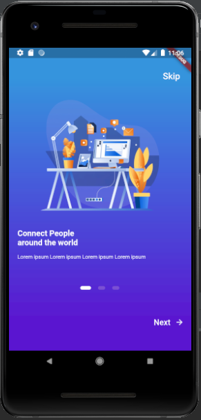
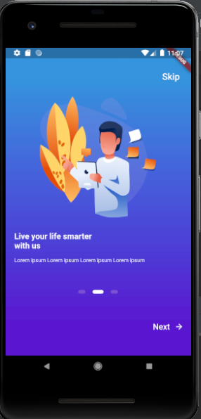
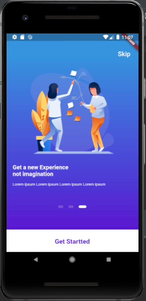
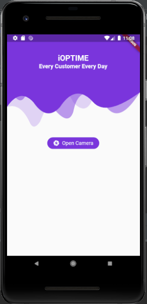

# objectdetectionapp

A new Flutter application.

## Getting Started

This project is a starting point for a Flutter application.

A few resources to get you started if this is your first Flutter project:

- [Lab: Write your first Flutter app](https://flutter.dev/docs/get-started/codelab)
- [Cookbook: Useful Flutter samples](https://flutter.dev/docs/cookbook)

For help getting started with Flutter, view our
[online documentation](https://flutter.dev/docs), which offers tutorials,
samples, guidance on mobile development, and a full API reference.

   

    

## References

https://pub.dev/packages/tflite

https://github.com/shaqian/flutter_realtime_detection

https://dribbble.com/shots/5698597-Fitness-App

https://github.com/TechieBlossom/FitnessApp

https://medium.com/innovation-incubator/real-time-image-classification-on-android-using-flutter-tflite-2674f03caf0f
